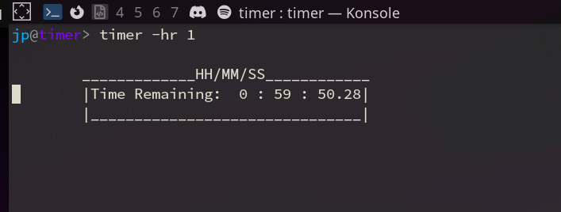

# Timer
Simple timer written in go



## Usage
```
timer <time in seconds>
```
- `-u` Count up or down, defaults to down from given time
- `-h` Display usage
- `-s` Time in seconds
- `-m` Time in minutes
- `-hr` Time in hours
- `-S` Stopwatch mode (the default if no args are given)

The times given will be summed together if more than one is specified.
But the time parameters will be ignored if a positional is given.
